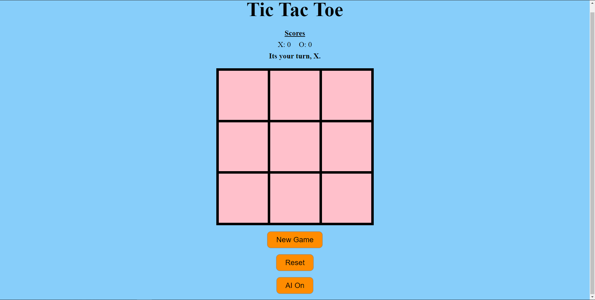
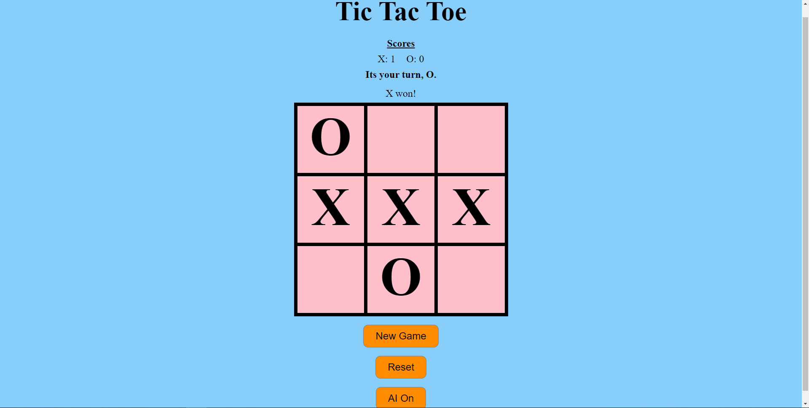
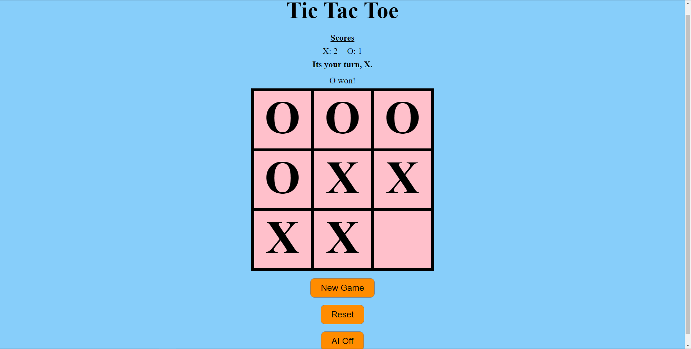
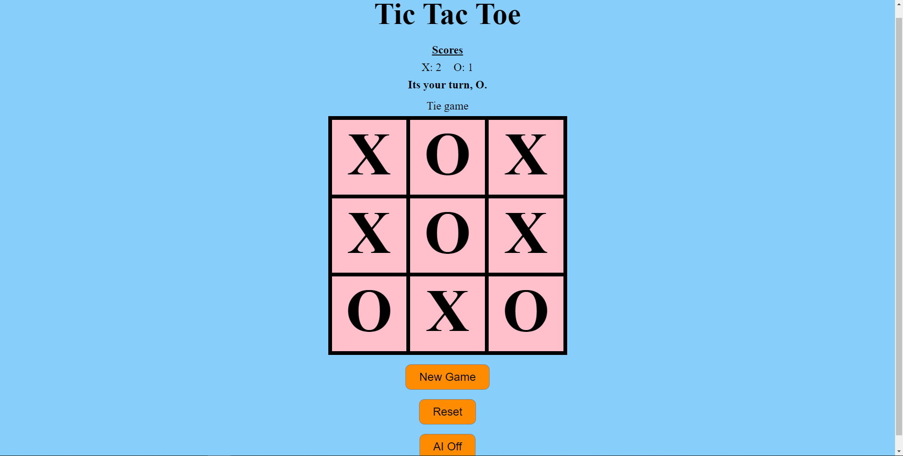

# CS110-Lab2

Isaac Curiel submission for Lab 2. Below are some screenshots of what it looks like.

GitHub repo link: https://github.com/isaac-18/CS110-Lab2

# Starting board

# Winning games

# Tie game

